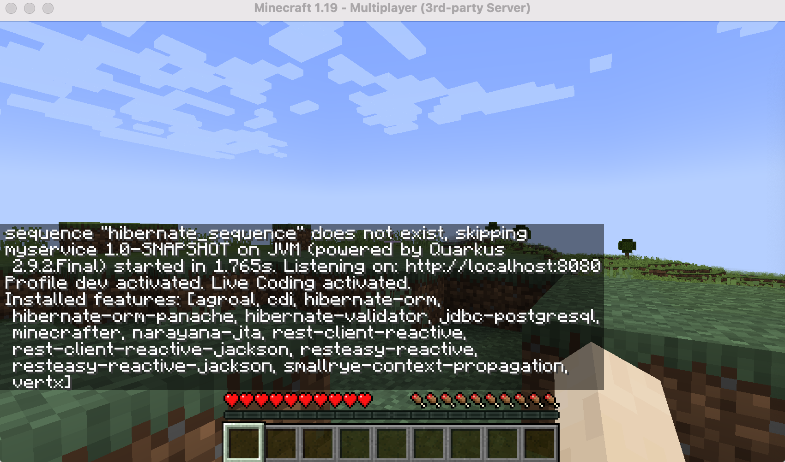
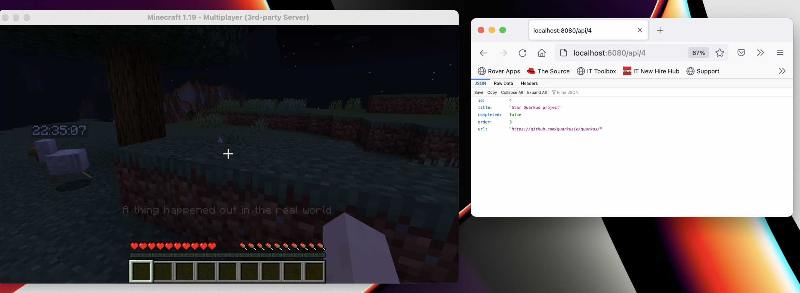
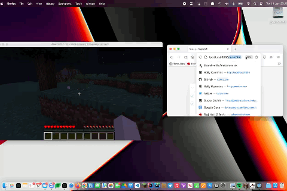
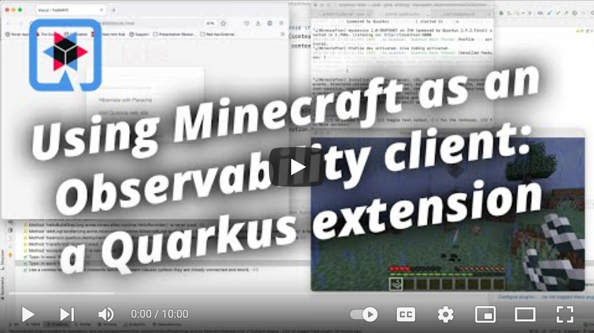

# Minecraft as an observability client: A Quarkus extension demo




## Quick start

### Build the minecraft server container

```bash
cd modded-minecraft
podman build -t minecraft-server .
```

The container build can be a bit slow the first time, be warned. If you're in a hurry, you can turn off dev services and use `./gradlew runServer` instead. If you'd like to test the built container, you can run `podman run -p 25565:25565 -p 8081:8081 minecraft-server.`
> **_INFO:_** First time you start the Minecraft server you will have to accept the eula by changing eula=false to eula=true in the file `modded-minecraft/run/eula.txt`

### Start the minecraft client

There are two ways to do this: 

- Java edition of Minecraft. This has a nice desktop icon, but it means the code needs to be upgraded every time a new client is released. The libraries do not have much backwards compatibility between releases.
- The client in the Forge Minecraft library. This ensures compatibility with the server. You may need to set `online-mode` to false on the server. To launch it, run

```
cd modded-minecraft
./gradlew runClient
```

In either case, start a multiplayer game, and connect to `localhost:25565`.

You will need to configure the client to allow you to `alt-tab` away from the client without it pausing and bringing up
a menu. Edit `options.txt` in
your [minecraft folder](https://gaming.stackexchange.com/questions/15664/can-i-alt-tab-out-of-minecraft-without-the-game-auto-pausing)
, and change `pauseOnLostFocus` to `false`.

```
pauseOnLostFocus:false
```

### Build the extension

```bash
cd extension
mvn install
```

### Start the sample application

```bash
cd quarkus-todo-app
quarkus dev
```

(If you do `mvn install`, with podman it should be `TESTCONTAINERS_RYUK_DISABLED="true" mvn install`.)



### Interact with the web app

Arrange your windows so you can see both the minecraft client and the web application.
Visit [http://localhost:8080](http://localhost:8080). While you're interacting with the web app, you should see things
happen in the minecraft world. Visiting the page will cause a mob to spawn, and an exception (like a 404) will cause an
explosion.




You can see a [video of the interactions](images/interactions.mov), or a [longer video with voiceover](https://www.youtube.com/watch?v=w5SBQpAQ8m8).

[](https://www.youtube.com/watch?v=w5SBQpAQ8m8)

A more complete [demo script](demo-script.md) is also available.
